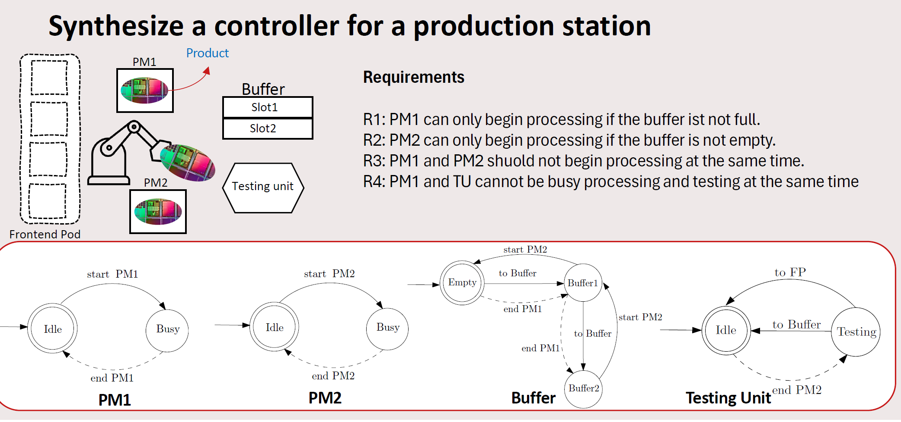

# Example case -- handling station
<!-- call out -->
The system aims to receive the product and process and test the received products with four components. After finishing the testing in the testing unit, the system exports the products to the next station via the frontend pod.  

The system is composed of 4 components:

I would not go through the details, the point is that an engineer can model the transitions of states for individual components by finite automata, then constrains the system with a set of requirements that the system must satisfy.  

The CIF derives transition edges through the synchronous composition of the production system, which includes both plants and their requirements. It then utilizes this list of LFA (Linearized Finite Automaton) transition edges to facilitate synthesis process.

I choose the grauanity of the deriving with transitional event, so, the transitional edges are derived per transitional event.  
For example, 

- e1: (event: startPM1) (guard: PM1.Idle) (assignment: PM1:=PM1.Busy)
- e2: (event: endPM1) (guard: PM1.Busy and $\neg$ Buffer.Buf2)  (assignment: PM1:=PM1.Idle, Buffer:= Buffer.Buf1 or Buffer.Buf2)
...
> (details are listed in my thesis report)

Thus, the edge 1 is denoted with: $e1 = [\text{PM1}]$.  
The edge 2 is denoted with: $e2 = [\text{PM1}, \text{Buffer}]$.  

Suppose the index of the four components are assigned as a list of nodes: 
<!-- insert a table -->
| Index | Component |
| --- | --- |
| 0 | PM1 |
| 1 | PM2 |
| 2 | Buffer |
| 3 | TU |

And the transitional matrix can be derived as follows:
<!-- insert a table -->
| Edge | Components | 
| --- | --- |
| $e1$ | [0] |
| $e2$ | [0, 2] |
| $e3$ | [1, 2] |
| $e4$ | [1, 3] |
| $e5$ | [2, 3] |
| $e6$ | [3] |

We can view this transitional relationship as a graph:
<!-- insert a graph -->

Where the nodes are the components and the edges are the transitional events.  
Further operations can be checked in file [Transitional_relationships.ipynb](../Transitional_relationships.ipynb).  