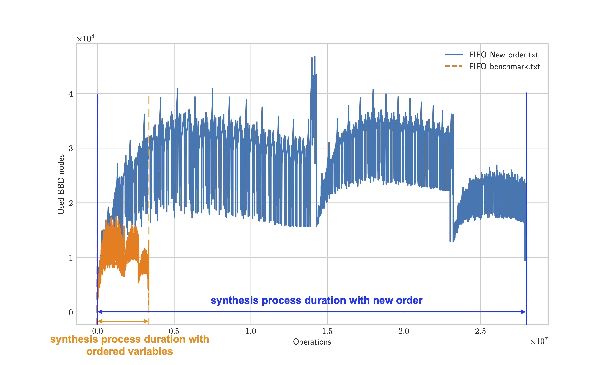
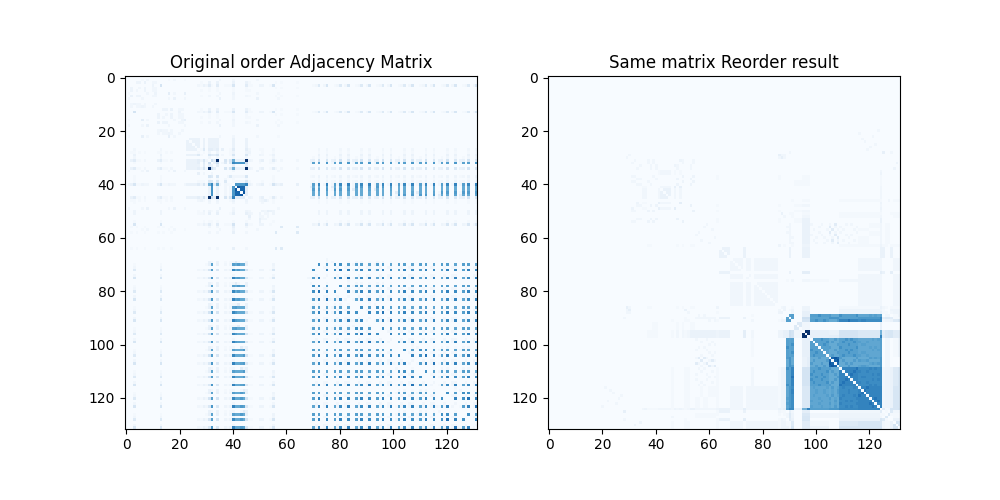

# Introduction
> The purpose of the git repository is to demonstrate part of my work.
> The benchmark cases are sourced from the [ESCET software application](https://eclipse.dev/escet/).
> The supervisor synthesis algorithm that is used in this demonstration is data-synthesis.

Supervisory control theory is brought up when early 80s', and is driven ever since. It is actually a powerful idea that modeling, analysis and control a mega system that includes tons of individual self-motion components.  

Simply put, the supervisory control theory is driven by discrete events, and it collects as much as information in the individual plants such that a supervisor $(S)$ can supervise all plants in the way as the engineer desires. 

A system includes 2 major things: plants that describe all components' behaviors and requirements that describe what the system may do. So the supervisor can supervise as plants describes, and the behaviors of the result satisfy the requirements specify. $L(P ‖ S) ⊆L(P ‖ R)$  
> $L$ is the language generated by the automaton. (Behaviors)

In ESCET, engineers can synthesize a supervisor after modeling the plants and requirements.  

> The most famous applying application of the theory is **SECS/GEM** (A framework used in semiconductor industry.), the system collects as much as information to give the host insight into how a tool is performing and to remotely control product processing. 

To synthesize a supervisor, however, is a difficult task (Thuijsman, S. et al. 2019).  

A branch of supervisory control theory aims at reducing the synthesis effort. And one of the method is to focus on analyzing the relationships of the offered system, then arrange the order of the variables (component) in the system, then reduce the effort of the synthesis (Lousberg et al. 2020).  

## Example of ordering impact on the effort of synthesis

In the ESCET, the variable are simplified as the constructed plants, which are the component of the system for the most cases.  

In the picture, the y-axis refers to the resource that has been used to represent the system during synthesis, and the x-axis refers to the operations that it has been used during synthesis. Taking the advantage by evaluating effort framework by Thuijsman, S. et al. (2019). It is easier to consider the y-axis as the space of synthesizing, and x-axis as the time of the synthesizing.  

## Relationships analysis in SCT
In this [Transitional_relationships.ipynb](./Transitional_relationships.ipynb), I provide a size-favorable example for introducing the transitional relationships in SCT. And what we can do about it. At the final part of the demonstration, the work of clustering first, then sorting (use Sloan order algorithm) after has been done. 
In short, we subtract the relationship of the systems as graph (might with multiple subgraphs), then reorder it.

> I write this part because I was trying to duplicate the algorithm.  

## Reference
> Thuijsman, S. et al. (2019) ‘Computational Effort of BDD-based Supervisor Synthesis of Extended Finite Automata’, in 2019 IEEE 15th International Conference on Automation Science and Engineering (CASE). 2019 IEEE 15th International Conference on Automation Science and Engineering (CASE), pp. 486–493  
> Lousberg, S.A.J., Thuijsman, S.B. and Reniers, M.A. (2020) ‘DSM-based variable ordering heuristic for reduced computational effort of symbolic supervisor synthesis’, in Proceedings of the 15th IFAC workshop on discrete event systems. Elsevier BV, pp. 429–436. Available at: https://doi.org/10.1016/j.ifacol.2021.04.058.  